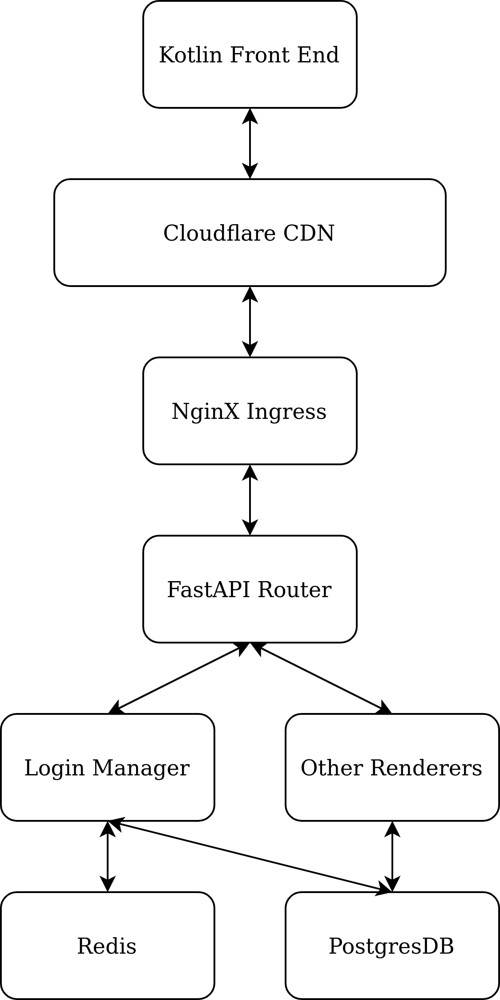

# Cryptex

The entire project consists of two parts: [frontend](https://github.com/ECE4410J-Pentagram/Pentagram-Frontend) and [backend](https://github.com/ECE4410J-Pentagram/Pentagram-Backend).

## Team Roster

- Baichun Li: Contributed part of the frontend system (including the key management part). Worked on the entire backend system, designed the Postgres SQL table structure, and designed the entire API structure. Maintained the official serverless cluster on Aliyun as a DevOps engineer.
- Che Chen: Proposed initial frontend layout and workflow and visualized on Figma. Wrote draft version of message receiving frontend.
- Pingbang Hu: Researched and implemented the *text2image Steganography algorithm* ([core](https://github.com/ECE4410J-Pentagram/Pentagram-Frontend/tree/main/app/src/main/java/cn/edu/sjtu/patrickli/cryptex/model/core)): Identifying the potential pitfall of the common [Image Steganography](https://github.com/aagarwal1012/Image-Steganography-Library-Android) library for Android and designing the improved *pseudo-randomized LSB* Embedding algorithm with RSA encryption.

  Proved the proposed *PR-LSB Embedding algorithm* is secure at the theoretical level, and analyzed various properties of which.
- Jiajun Wang: Contributed to project proposal and implementation. Worked on Trello and Figma and thesis.
- Siwei Wang: Completed part of the codes for the UI of Skeletal Demo. Contributed to project presentations and proposals. Led story map and workflow creation. Designed Figma interface. Presented Skeletal Demo and MVP Demo. Drafted 12 pages of the thesis.
- Yiwen Yang: Implemented frontend message sending and sharing logic. Designed and implemented QR Code sharing and frontend friend invitation process. Designed and managed client-side database and secure key storage. Designed encryption and decryption key generation. Connected frontend to backend using REST API.

### Challenges

During the app development process, our team encountered several challenges, with one major hurdle being the decision regarding the inclusion of a shortcut menu. Initially, we had invested a considerable amount of effort in developing and implementing the shortcut menu feature. However, as the development progressed, we realized the necessity of saved contacts in the backend for a seamless user experience. This realization led us to an extensive discussion within the team to evaluate the trade-offs and potential impact on the overall functionality and user satisfaction. After careful consideration, we made the difficult choice to pivot and prioritize the development of saved contacts over the shortcut menu. This decision required additional effort to restructure and adapt the existing codebase, but we believe it was the right move to ensure a more robust and user-friendly app.

## Getting Started

### Frontend

Clone the frontend code from [Pentagram-Frontend](https://github.com/ECE4410J-Pentagram/Pentagram-Frontend):

```bash
git clone git@github.com:ECE4410J-Pentagram/Pentagram-Frontend.git
```

In your [Android Studio](https://developer.android.com/studio), open the project `Pentagram-Frontend`. Our project uses [Groovy Gradle](https://developer.android.com/studio/build) as the build tool, and you can easily build the app in Android Studio by clicking the `run` button. You can use our server (which is by default) directly, or you may set up your own server by following steps [here](#backend). If you want to use your own server, make sure to modify `apiUrl` in `app/src/main/java/cn/edu/sjtu/patrickli/cryptex/model/RequestStore.kt`:

```kotlin
class RequestStore {
    private val apiUrl = "https://example.com/api/"
}
```

### Backend

We provide a default official server at `https://cryptex.software/api/`, but you can also set up a private server if you want.

Please note our service depends on Redis and PostgresDB.

#### Development Environment Setup

- Bare-metal Service (Development Mode)

Clone the repository:

```bash
git clone git@github.com:ECE4410J-Pentagram/Pentagram-Backend.git
```

Start a development mode Redis and a PostgresDB:

```bash
docker compose -f dev_db/docker-compose.yml up -d
```

Prepare the environment:

```bash
pip3 install -r requirements.txt
```

Set up the PostgresDB tables:

```bash
python3 createDB.py
```

Start the server:

```bash
python3 -m uvicorn app:app
```

#### Production Environment Setup

Before you start our service, you need to set up a PostgresDB and a Redis. You need to keep your database and Redis credentials in `secret.env` file:

```
POSTGRES_USER=XXXXX
POSTGRES_PASSWORD=XXXXX
POSTGRES_DB=XXXXX
POSTGRES_HOST=XXXXX
POSTGRES_PORT=XXXXX
REDIS_HOST=XXXXX
REDIS_USERNAME=XXXXX
REDIS_PASSWORD=XXXXX
```

You can also add `ENV=dev` to make sure that the system runs in development mode. By default, the environment variable is set to `ENV=prod`.

- Using Docker (Production Build)

Pull the docker image from ghcr.

```bash
docker pull ghcr.io/ece4410j-pentagram/pentagram-backend
```

Start the container.

```bash
docker run --rm -it -p 8000:8000 --env-file secret.env ghcr.io/ece4410j-pentagram/pentagram-backend
```

**Note:** If you need to initialize the database table structure, do not forget to run `python3 createDB.py` inside the container. It is not automatic.

- Using Docker Compose (Production Build)

Create a file called `docker-compose.yml`. Edit the file and input:

```yaml
version: '3.7'

services:
  pentagram:
    image: ghcr.io/ece4410j-pentagram/pentagram-backend
    env_file:
      - secret.env
    ports:
      - 8000:8000
```

Run the service with:

```bash
docker compose up -d
```

**Note:** If you need to initialize the database table structure, do not forget to run `python3 createDB.py` inside the container. It is not automatic.

## Model and Engine

### Back End Data Flow Diagram

The back-end data flow design is shown below.



#### Cloudflare CDN

#### NginX Ingress

#### FastAPI Router

#### Login Manager

#### Other Renderers

#### Redis

#### PostgresDB

### Front End Data Flow Diagram

#### Image Encrypter/Decrypter

The basic feature in the *Image Encrypter/Decrypter* block is to encrypt/decrypt a secret message into an image using the proposed *PR-LSB embedding algorithm*. It takes in three inputs, a secret message, an image, and the user you're sending the image (the receiver).

We first encrypt the secret message to the ciphertext with the receiver's public key, then generate a pseudo-random sequence (the prefix *PR*). Then, we use the usual LSB embedding algorithm to encrypt the ciphertext to the image, where the order is with respect to the generated pseudo-random sequence. This design choice is to break the potential detectability of an encrypted image, where we provide more details and proofs in the Thesis.

## APIs and Controller

The API definitions are provided with ReDoc on our [Official Server](https://cryptex.software/api/docs).

## View and UI/UX

We decided to use a relatively concise UI design following our designed workflow and presenting our functions to the customers. Based on the mockup usability test results, the users want clearer instructions for their next steps, and our final UI enables them to encrypt and decrypt the desired text step by step without confusion. We also applied different modes, including auto, day, and night modes. This also caters to the needs of users mentioned in the mockup usability test.
